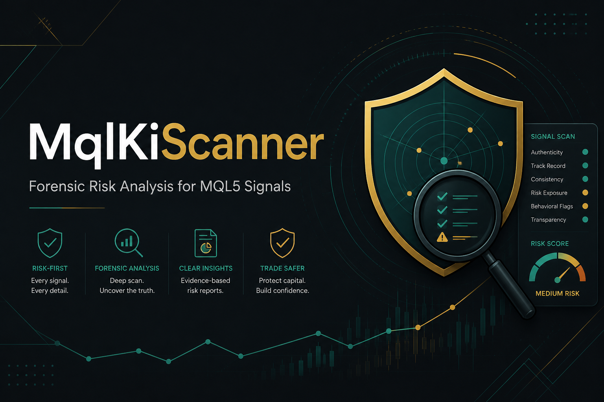

<p align="center">
  
</p>

# MqlKiScanner

**Forensischer Scanner für MQL5-Handelssignale (MT4 + MT5).**  
Python · Streamlit · optionale GLM-Berichte.

> **Risiko vor Ertrag.** Harte Drawdown-Schranke (Standard 30 %), Mindest-Ertrag 5 %/Monat, und kein positives Urteil ohne belastbaren Stop-Nachweis.

[](https://www.python.org/downloads/)
[](https://streamlit.io/)
[](#lizenz--hinweis)

---

## Warum dieses Tool?

Signalnamen lügen („Low Risk“, „Stable“, „Hedge“). Abonnentenzahlen korrelieren mit Marketing, nicht mit Qualität. MqlKiScanner holt Trade-Historien, **rechnet** Exposure, Martingale, Drawdown und Stop-Signaturen selbst — und lässt ein LLM nur noch formulieren, nie rechnen.

Entstanden aus einer forensischen Analyse-Reihe (u. a. Gold Spike, KiraCat, Pure Gold 2000) — Ankerwerte sind in `scripts/verify_engine.py` regressionssicher hinterlegt.

## Features

- **MT4 + MT5** Signallisten crawlen, filtern, Top-N gründlich prüfen
- **Korrekte Export-URLs:** MT5 `/export/positions`, MT4 `/export/history` (Orderbuch mit S/L)
- **Forensik-Batterie:** Martingale · Peak-Exposure (Anzahl- + Schock-Peak) · Stops · Drawdown
- **Harte Schranke** auf max(Trading-DD, EQ-DD); Score mit 7 Dimensionen
- **Optional GLM:** Trade-Analyse + Risiko parallel, dann Gesamtbericht
- **SQLite-Persistenz** und Ergebnisse-UI mit NEU-Markierung
- **Rate-Limit / Fail-Fast** zum Schutz des MQL5-Accounts

## Schnellstart

```bash
git clone https://github.com/tnickel/MqlKiScanner.git
cd MqlKiScanner
python -m venv .venv
# Windows: .venv\Scripts\activate
pip install -r requirements.txt
copy .env.example .env   # Keys eintragen — oder später in der Admin-UI
streamlit run streamlit_app.py
```

Windows: `start.bat` doppelklicken → http://localhost:8501

Ohne MQL5-Login: **Testdaten** aus `data/raw/` (Engine-Verifikation).  
Ohne GLM-Key: Scan + Forensik laufen, KI-Schritt ist optional.

## Secrets (wichtig für Forks)

| Geheimnis | Variable | Speicherung |
|---|---|---|
| GLM / Z.ai Key | `GLM_API_KEY` | Env / `.env` / Admin-UI |
| MQL5 User | `MQL5_USER` | Env / `.env` / Admin-UI |
| MQL5 Passwort | `MQL5_PASS` | Env / `.env` / Admin-UI |

**Nie committen:** `.env`, `config/secrets.local.json`, `data/mql5_cookies.json`, `data/chrome_profile/`.  
Details: [`SECURITY.md`](SECURITY.md) · [`doc/09_sicherheit.md`](doc/09_sicherheit.md)

## Dokumentation

| Dokument | Inhalt |
|---|---|
| [`doc/README.md`](doc/README.md) | Dokumentations-Index |
| [`doc/07_benutzerhandbuch.md`](doc/07_benutzerhandbuch.md) | Bedienung der App |
| [`doc/08_architektur.md`](doc/08_architektur.md) | Schichten & Datenfluss |
| [`doc/02_technik-mql5.md`](doc/02_technik-mql5.md) | Endpunkte & CSV-Formate |
| [`doc/03_forensik-tests.md`](doc/03_forensik-tests.md) | Test-Spec & Scoring |
| [`AGENTS.md`](AGENTS.md) | Regeln für KI-Agenten |

## Tests

```bash
python scripts/verify_engine.py   # Anker gegen die Analyse-Reihe
python -m pytest tests -q         # Unit- + UI-Tests
```

## Projektstruktur (kurz)

```
streamlit_app.py          Einstieg
app_pages/                Scan · Ergebnisse · Admin
src/mqlkiscanner/         Engine, Forensik, MQL5, LLM, DB
data/raw/                 Öffentliche Referenz-CSVs (Verifikation)
config/prompts/           Editierbare LLM-Prompts
doc/                      Ausführliche Dokumentation
tests/                    pytest
```

## Lizenz / Hinweis

Analyse-Werkzeug, **keine** Anlageberatung und **kein** Order-Routing.  
Historische Kennzahlen ≠ Zukunft. Automatisierte Abrufe können gegen die
MQL5-Nutzungsbedingungen verstoßen — Rate-Limits beachten, Account-Risiko
liegt beim Nutzer.
