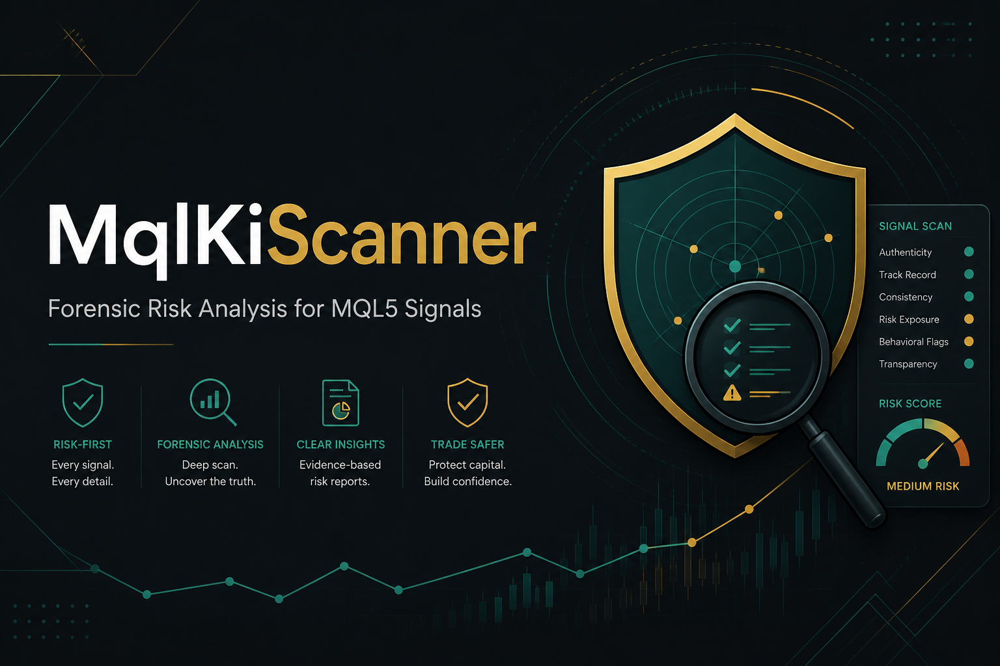

<p align="center">
  
</p>

# SignalKiScanner (MqlKiScanner Hub)

**Zentraler Multi-Source-Hub & forensischer Scanner für Trading-Signale (MQL5, Pelican, RoboForex, Vantage, ZuluTrade).**  
Python 3.12 · Streamlit · deterministische Vektormathematik · GLM-5.3 Multi-Agenten-Audits.

> **Risiko vor Ertrag.** Harte Drawdown-Schranke (Standard 30 %), Mindest-Ertrag 5 %/Monat, RetDD-Effizienz nach Calmar-Standard, und kein positives Urteil ohne belastbaren Stop-Nachweis.

[](https://www.python.org/downloads/)
[](https://streamlit.io/)
[](#tests)
[](#lizenz--hinweis)

---

## Warum dieses Tool?

Signalnamen lügen („Low Risk“, „Stable“, „Hedge“). Abonnentenzahlen korrelieren mit Marketing, nicht mit Qualität. Weit über 99 % aller Signal-Provider sind tickende Zeitbomben. Der SignalKiScanner holt die Rohdaten aller angebundenen Quellen über standardisierte REST-Schnittstellen ab, **rechnet** Exposure, Martingale, echten Drawdown und Stop-Signaturen deterministisch selbst — und lässt LLMs (GLM-5.3) nur noch als Gutachter interpretieren, niemals rechnen.

## Features

- **Multi-Source-Hub:** Bindet MQL5, Pelican Trading, RoboForex CopyFX, Vantage Copy und ZuluTrade über das standardisierte Protokoll `mql5-downloader-v1` an.
- **SHA-256 Delta-Ingest:** Unveränderte Signale und Tradelisten werden über kryptografische Checksums sofort erkannt – kein unnötiger Rechenaufwand, kein Token-Verbrauch.
- **RetDD-Effizienz:** Berechnet die Rendite-Risiko-Effizienz nach Calmar-Standard (`cagr_jahr_pct ÷ MaxDD`) sowie das geometrische Monatsmittel (`ertrag_monat_geom_pct`); 9. Zelle in der Ampel-Matrix.
- **Kopier-Simulation in der KI-Studie:** Interaktive Simulation mit konstantem 10.000-USD-Modellkonto („Was wäre mit deinem Konto passiert?“).
- **Kapitalfluss-Brücke:** Erkennt historische Einlagen und Entnahmen auf MQL5, um verzerrte Broker-Drawdown-Angaben zu korrigieren.
- **Deterministische Forensik-Batterie:**
  - Martingale- & Lot-Größen-Explosionserkennung
  - Peak-Exposure (Anzahl- und Schock-Peak)
  - Stop-Loss-Evidenz (Orderbuch-Prüfung vs. statistisches Verlustbegrenzungsverhalten)
  - Rekonstruierter Equity-Drawdown (M1/M5-Candle-Replay mit Auto-GMT-Zeitsynchronisation)
  - Harte 30-%-Drawdown-Schranke
- **GLM-5.3 Multi-Agenten-Audits:** Parallele Untersuchung durch Agent 1 (Mikrostruktur) und Agent 2 (Extremrisiken/Hebel) mit finalem Synthesebericht und KI-Risiko-Score (1–10).
- **Append-only Wechsel-Protokoll:** Lückenlose Historisierung jedes Ampelwechsels (alt → neu je Kriterium) zur revisionssicheren Nachvollziehbarkeit.
- **Zwei Scan-Modi:** **Full-Scan** (alle Kandidaten) und **Gelb/Grün-Scan** (fokussierte Überwachungsrunde für bestehende Freigaben).
- **Tradeserver-Sync v1:** Transaktionale Synchronisation von Signaldaten und PDF-Dossiers zum `MqlTradeMonitor` (:8080).
- **REST-API für Real-Monitore:** Schreibgeschützte Schnittstelle unter `127.0.0.1:8611` (`/health`, `/signals?ampel=gruen,gelb`) für nachgelagerte Follower-Clients.

## Schnellstart

```bash
git clone https://github.com/tnickel/MqlKiScanner.git
cd MqlKiScanner
python -m venv .venv
# Windows: .venv\Scripts\activate
pip install -r requirements.txt
copy .env.example .env   # Keys eintragen — oder später in der Admin-UI
streamlit run streamlit_app.py
```

Unter Windows: Doppelklick auf `start.bat` → http://localhost:8504

## Dokumentation

| Dokument | Inhalt |
|---|---|
| [`doc/README.md`](doc/README.md) | Dokumentations-Index |
| [`doc/21_megaprojekt-architektur.md`](doc/21_megaprojekt-architektur.md) | **Gesamtdoku Megaprojekt**: 5 Quellen + Hub + TradeMonitor |
| [`doc/20_konzept-multi-source-hub.md`](doc/20_konzept-multi-source-hub.md) | Multi-Source-Hub Protokoll & REST-Anbindung |
| [`doc/07_benutzerhandbuch.md`](doc/07_benutzerhandbuch.md) | Bedienung der Streamlit-App |
| [`doc/08_architektur.md`](doc/08_architektur.md) | Schichten, Module & Datenfluss |
| [`doc/03_forensik-tests.md`](doc/03_forensik-tests.md) | Test-Spezifikation & Scoring |
| [`AGENTS.md`](AGENTS.md) | Regeln für KI-Agenten & Umsetzungsstand |

## Tests

```bash
python scripts/verify_engine.py   # Anker-Checks gegen data/raw/
python -m pytest tests -q         # 1.331 automatisierte Tests
```

## Lizenz / Hinweis

Analyse-Werkzeug, **keine** Anlageberatung und **kein** Order-Routing. Historische Kennzahlen garantieren keine zukünftigen Ergebnisse.
